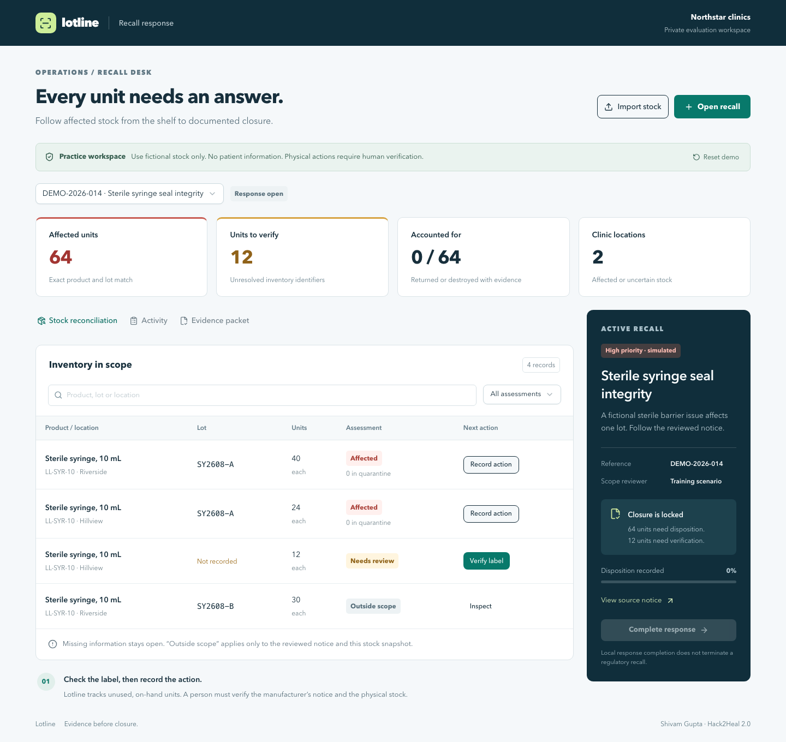
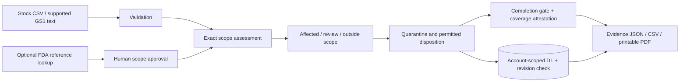

# Lotline

**Every unit needs an answer.**

Lotline is an evaluation MVP for unused medical-device stock recalls at small US clinic groups. It turns a human-reviewed notice into an exact inventory assessment, keeps missing identifiers unresolved, records quarantine and permitted disposition, and exports an evidence packet.

Created by **Shivam Gupta** for **Hack2Heal 2.0** with substantial AI assistance. See [ACKNOWLEDGEMENTS.md](ACKNOWLEDGEMENTS.md).



## Why it exists

An alert cannot inspect a stockroom. A clinic still has to locate the right product and lot, investigate incomplete records, account for affected units, and document the response. Lotline makes the unfinished work explicit.

The fictional demo begins with **64 affected units, 12 units with no recorded lot, and 30 units outside the reviewed scope**. Verify the 12 labels, record quarantine and return of all 76 affected units, then complete the response. A missing lot never becomes an all-clear.

## Implemented

- Account-scoped persistent workspaces in Cloudflare D1, protected by Sites sign-in.
- Atomic CSV validation and import, limited to 500 stock records per workspace.
- Exact manufacturer/product/lot assessment with three explicit states: affected, needs review, outside reviewed scope.
- Supported GS1 text parsing and GTIN check-digit validation, preserving leading zeroes.
- Optional live FDA device recall lookup, with the original source and retrieval timestamp. Lookup never approves scope automatically.
- Human-approved single-product scope, exact lots or explicit all-lots, and source-authorized return or destruction.
- Server-enforced quantity conservation. Disposition cannot exceed quarantine. Unknown records cannot receive physical actions.
- Completion gate, inventory coverage attestation, and locked completed responses.
- Optimistic concurrency, lifetime request deduplication, payload-conflict checks, bounded request streaming, and account ownership predicates.
- JSON evidence packets with a SHA-256 digest and audit hash chain, spreadsheet-safe CSV exports, and printable PDF view.
- Responsive keyboard-accessible UI with error recovery, source review, activity history and scoped search.
- Optional WebMCP read/stage tools. Physical actions still require a person to complete the form.

## Run locally

Requires Node.js 22.13+ and npm. No paid API key is required for the core workflow.

```sh
npm ci
npm run build
npm run db:migrate:local
npm run dev
```

Open the exact local URL printed by the server (normally `http://localhost:5173`). Use its Sign in with ChatGPT flow. The starter simulates a test identity **only on loopback development requests**. It does not use real credentials.

The production app uses the Sites authentication gateway. **Do not expose the local development server or raw Worker directly to the public internet:** identity headers are trusted only behind that gateway. See [security model](docs/SECURITY.md).

The database is local under ignored `.wrangler/state/` during development. Hosted workspaces use D1. Browser storage is not the authoritative database.

```sh
npm test
npm run typecheck
npm run build
```

`npm test` exercises the actual matching engine and reducer, including all three adversarial review regressions. Browser/API verification and its reproducible script are documented in [TESTING.md](docs/TESTING.md).

## Three-minute demo

1. Open **View source notice**. The fictional notice permits return of catalog `LL-SYR-10`, individual lot `SY2608-A`.
2. Click **Verify label** for 12 Hillview units. Enter `SY2608-A` and a label-verification reference. Save. The summary becomes 76 affected and 0 unresolved.
3. For each affected row (40, 24, 12): **Record action**, enter quarantine evidence, and **Save action**. Then **Record return**, enter a supplier receipt reference, and save.
4. **Complete response**, enter the final review record, attest coverage and **Complete and lock response**.
5. Open **Evidence packet**, download JSON/CSV, or print/save PDF. **Activity** shows the event chain.
6. **Reset demo** restores the practice data after an explicit confirmation. Export anything you want to keep first.

Every product, clinic and physical action in this scenario is fictional. The app does not contact suppliers or move stock.

## Inventory contract

CSV headers, in any order:

```csv
id,product,manufacturer,catalog,gtin,lot,location,quantity,unit
NEW-001,Sterile syringe,Northstar Medical (fictional),LL-SYR-10,,SY2608-A,Lakeside,10,each
```

Use unique stable stock IDs. Imports append distinct physical stock to the current snapshot; never import the same stock under new IDs. Quantities must be positive integers in **each**, not boxes. Convert packaging quantities before import. Quote embedded commas/newlines. Preserve leading zeroes. Common missing markers such as blank, `N/A` and `unknown` remain unresolved when they prevent matching. The [example CSV](public/samples/inventory-template.csv) is ready to use.

## Supported scope and deliberate limits

- One catalog and/or one individual-unit GTIN for the same product per response. Verify manufacturer identity separately from the recalling distributor.
- Exact enumerated lots, or an explicit all-lots declaration. Ranges, wildcard expressions and multi-product notices require separate reviewed responses. Serial-number recalls and nested-package exceptions are outside this MVP.
- On-hand unused stock only. Patient traceability, used products, replacement-product decisions, device repairs/corrections and clinical advice are outside scope.
- Overlapping recalls cannot both record physical actions on the same stock ID. A shared-disposition model is future work.
- Stock label edits are locked after physical actions. Imports are blocked once a response is completed; start a new practice evaluation for a corrected snapshot.
- Account workspaces are private to one signed-in user. Organization memberships, group roles and cross-user collaboration are **not** implemented.
- Evidence entries are operator attestations with references, not uploaded attachments or independently verified events. The digest is not a digital signature, external notarization or proof of physical action.
- The FDA lookup is an optional reference convenience. Verify the latest manufacturer notice and amendments. It is not a complete alert feed or a clinical decision service.
- Evaluation limits: 500 stock records, 20 responses, 2,000 audit events; 250 KB request body, 200 KB CSV input, and 1.5 MB serialized workspace capacity.

**Status:** deployed evaluation MVP; not clinically validated or approved for live patient-care operations. No HIPAA/GDPR compliance, reduction in harm, paid traction, or organizer-template compliance is claimed. Production use requires customer discovery, supervised validation, organizational access, retention/backups, monitored operations and security review.

## Architecture



The matching engine in `lib/lotline/domain.ts` is pure. `actions.ts` validates and applies transitions. `storage.ts` uses prepared D1 statements and a revision-checked atomic update. API routes authenticate every request. `app/workbench.tsx` renders the same stored state used by exports.

See [product and business case](docs/PRODUCT.md), [security model](docs/SECURITY.md), [testing](docs/TESTING.md), [sources](docs/SOURCES.md), and [deployment](docs/DEPLOYMENT.md).

## Submission materials

The [submission folder](submission/) contains the supplemental pitch, Devpost copy, word-for-word demo script, recording guide, timed captions and internal rubric review. The official organizer template was not publicly downloadable. Transfer the required sections before submitting; these files do not claim template compliance.

## License

MIT. Third-party dependencies retain their own licenses. FDA source material is linked and attributed. No FDA, GS1, clinic, distributor or hackathon endorsement is implied.
