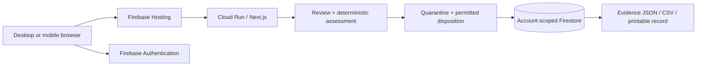

# Lotline

**Every unit needs an answer.**

Lotline helps clinic operations teams turn a medical-device recall notice into an accountable inventory response. Review the source, identify affected stock, investigate missing identifiers, record quarantine and permitted disposition, and export the response record.

Created by **Shivam Gupta**, with AI-assisted development. See [acknowledgements](ACKNOWLEDGEMENTS.md).


## Start with the workflow

1. **Try the demo.** Explore fictional stock in an anonymous workspace. No account or patient information is needed.
2. **Create an account.** Use email and password to return to your records across devices. Password reset is available from sign-in.
3. **Open your inventory workspace.** Registered users can switch to a separate, clean workspace for their own nonpatient inventory. The demo remains separate.
4. **Review a notice.** Confirm the manufacturer, supported product identifiers, exact affected lots, and permitted action against the source.
5. **Account for the stock.** Resolve missing labels, record quarantine and permitted return or destruction, then complete the final review when quantities reconcile.
6. **Keep the evidence.** Export JSON, stock CSV, or a printable response record.

Lotline works on desktop and mobile. Each account owns its records; shared organization memberships and staff roles are not implemented.

## What makes the response reviewable

- **Explicit uncertainty.** Missing or conflicting identifiers stay visible for investigation. “Outside this reviewed scope” is not a general statement that a product is safe.
- **Deterministic assessment.** Product and lot comparisons use inspectable rules. An optional FDA lookup supplies reference material; a person approves the scope.
- **Source-permitted action.** A return-only response cannot be completed by recording destruction. Disposition cannot exceed quarantine, and quarantine cannot exceed stock.
- **Consistent updates.** Server-side validation, revision checks, and request deduplication prevent conflicting writes and repeated action submissions from silently changing totals.
- **A complete record.** Evidence exports include the reviewed scope, stock, recorded actions, and activity history. SHA-256 checksums help check file consistency; they are not signatures or independent proof of physical handling.

## Deploy to Firebase

Open **Google Cloud Shell**, select a **billing-enabled project**, and run this single command (no checkout required):

```sh
bash <(curl -fsSL https://raw.githubusercontent.com/shi1720/lotline-hack2heal/main/scripts/deploy-firebase.sh)
```

From an existing checkout:

```sh
bash scripts/deploy-firebase.sh
```

Or choose the project explicitly:

```sh
bash scripts/deploy-firebase.sh --project YOUR_PROJECT_ID
```

The command provisions Firebase Hosting and Authentication, a dedicated Firestore database named `lotline`, and a Cloud Run backend. It builds in Cloud Build, publishes HTTPS, and checks the live workflow. No downloaded service-account key, separate Firebase CLI login, or local Docker installation is required.

The preferred address is `https://lotline.web.app`. If that name is unavailable, the deployer tries `https://lotline-PROJECT_NUMBER.web.app`. The final address is printed after deployment; a particular hostname is not guaranteed.

**Deployment requires setup permissions and can incur usage charges.** Cloud Run is configured with zero minimum and two maximum instances. That limits one part of the deployment; it is not a spending cap or a free-hosting guarantee. See the [Firebase deployment guide](docs/FIREBASE.md) for prerequisites, costs, resource names, and troubleshooting.

## Inventory format

CSV columns, in any order:

```csv
id,product,manufacturer,catalog,gtin,lot,location,quantity,unit
STOCK-001,Example device,Example manufacturer,CAT-100,,LOT-001,Main stockroom,10,each
```

The row above is illustrative. Import only nonpatient inventory you are authorized to manage.

- Use stable, unique stock IDs. Imports append stock; do not re-import the same physical units under different IDs.
- Quantities are positive whole numbers in `each`, not boxes. Convert and verify packaging quantities before importing.
- Preserve leading zeroes in GTINs. Supported GS1 text parsing and check-digit validation help with identifier entry; universal barcode-scanner compatibility is not implied.
- Blank or placeholder identifiers remain unresolved when they prevent assessment.
- The workspace accepts up to 500 stock records. Quote commas and line breaks inside CSV values.

Use the [inventory template](public/samples/inventory-template.csv) as the starting point.

## Supported response scope

One catalog and/or one individual-unit GTIN for the same product, with exact enumerated lots or an explicitly reviewed all-lots scope. Manufacturer identity and packaging level must be verified. Complex ranges, wildcard expressions, serial-number recalls, multiple products, and nested-package exceptions require handling outside the supported simple scope.

The workflow covers **on-hand, unused stock**. It does not make treatment decisions or track patients and already-used devices. Operator evidence records what was reported; it does not independently confirm events in the stockroom or contact a supplier.

Completed responses are locked. Stock labels cannot change after physical actions, and overlapping responses cannot both record movement for the same stock ID. Imports are blocked after completion to keep that snapshot consistent. A new inventory-cycle/archive workflow is not yet provided; use this release for a bounded response exercise. Workspace limits include 20 responses, 2,000 audit events, and bounded request and storage sizes.

## Accounts and data

Firebase Authentication establishes identity. The backend verifies the session and stores account-scoped state in the named `lotline` Firestore database. Browser storage is not the authoritative inventory database. Anonymous access is for the demo; clearing browser data may remove access to an anonymous identity.

The inventory workspace starts empty and remains separate from the demo. Switching views does not reset either workspace. Only the sample demo has a reset control; it cannot erase your inventory.

Do not enter patient names, clinical histories, or other patient information. Before operational adoption, define your organization's source-review, access, retention, backup, and verification responsibilities. No clinical-effectiveness or regulatory-compliance claim is made.

## Development and verification

The core assessment logic is in `lib/lotline/domain.ts`; `actions.ts` validates state transitions. Firebase adapters use verified sessions and Firestore transactions. `deploy/firebase/stage.py` builds a standalone Next.js tree from an allowlist and applies the Firebase adapters without modifying the source checkout.

```sh
npm ci
npm test
npm run typecheck
```

See [testing](docs/TESTING.md) for the current results and reproducible browser/API checks. Deployment builds the Firebase target in Cloud Build. A successful source build alone does not verify cloud permissions, auth provider configuration, or the live database; the deployer also runs smoke checks.



## Product direction

The initial focus is small US clinic groups and distributors that support them. The pricing experiment is **US$99 per group per month for up to three sites, plus US$19 per additional site**. This is a hypothesis to test, not an offered subscription or validated willingness to pay. See the [product and business case](docs/PRODUCT.md).

Useful next steps include shared organization roles, source amendments, evidence attachments, and a shared-disposition model for overlapping recalls. Customer research and supervised workflow validation should determine their order.

## License

MIT. Third-party dependencies retain their own licenses. Public source material is linked in [sources](docs/SOURCES.md). No FDA, GS1, clinic, or distributor endorsement is implied.
